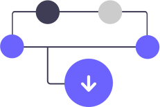

<!--START-->
<p align="center">
  
</p>

<p align="center">
  Download, verify, and extract GitHub release artifacts effortlessly right from Elixir
</p>

<p align="center">
  <a href="https://hex.pm/packages/octo_fetch">
    
  </a>

  <a href="https://github.com/akoutmos/octo_fetch/actions">
    
  </a>

  <a href="https://coveralls.io/github/akoutmos/octo_fetch?branch=master">
    
  </a>

  <a href="https://github.com/sponsors/akoutmos">
    
  </a>
</p>

<br>
<!--END-->

# Contents

- [Installation](#installation)
- [Supporting OctoFetch](#supporting-octofetch)
- [Setting Up OctoFetch](#setting-up-octofetch)
- [Attribution](#attribution)

## Installation

[Available in Hex](https://hex.pm/packages/octo_fetch), the package can be installed by adding
`octo_fetch` to your list of dependencies in `mix.exs`:

```elixir
def deps do
  [
    {:octo_fetch, "~> 0.4.0"}
  ]
end
```

Documentation can be found at [https://hexdocs.pm/octo_fetch](https://hexdocs.pm/octo_fetch).

## Supporting OctoFetch

If you rely on this library, it would much appreciated if you can give back to the project in order to help
ensure its continued development.

### Gold Sponsors

<a href="https://github.com/sponsors/akoutmos/sponsorships?sponsor=akoutmos&tier_id=58083">
  
</a>

### Silver Sponsors

<a href="https://github.com/sponsors/akoutmos/sponsorships?sponsor=akoutmos&tier_id=58082">
  
</a>

### Bronze Sponsors

<a href="https://github.com/sponsors/akoutmos/sponsorships?sponsor=akoutmos&tier_id=17615">
  
</a>

## Setting Up OctoFetch

If you want to create a downloader utility for a particular GitHub repository, you can use this library
to take care of all of the boilerplate, validation, and archive extraction. For example, if you want to create
a downloader for Litestream, you can do the following:

```elixir
defmodule LiteStream.Downloader do
  use OctoFetch,
    latest_version: "0.3.9",
    github_repo: "benbjohnson/litestream",
    download_versions: %{
      "0.3.9" => [
        {:darwin, :amd64, "74599a34dc440c19544f533be2ef14cd4378ec1969b9b4fcfd24158946541869"},
        {:linux, :amd64, "806e1cca4a2a105a36f219a4c212a220569d50a8f13f45f38ebe49e6699ab99f"},
        {:linux, :arm64, "61acea9d960633f6df514972688c47fa26979fbdb5b4e81ebc42f4904394c5c5"}
      ],
      "0.3.8" => [
        {:darwin, :amd64, "d359a4edd1cb98f59a1a7c787bbd0ed30c6cc3126b02deb05a0ca501ff94a46a"},
        {:linux, :amd64, "530723d95a51ee180e29b8eba9fee8ddafc80a01cab7965290fb6d6fc31381b3"},
        {:linux, :arm64, "1d6fb542c65b7b8bf91c8859d99f2f48b0b3251cc201341281f8f2c686dd81e2"}
      ]
    }

  # You must implement this function to generate the names of the downloads based on the
  # user's current running environment
  @impl true
  def download_name(version, :darwin, arch), do: "litestream-v\#{version}-darwin-\#{arch}.zip"
  def download_name(version, :linux, arch), do: "litestream-v\#{version}-linux-\#{arch}.tar.gz"
end
```

You would then be able to download the release artifact by doing the following:

```elixir
iex (1) > Litestream.Downloader.download(".")
{:ok, ["./litestream"], []}
```

## Attribution

It wouldn't be right to not include somewhere in this project a "thank you" to the various projects and people that
helped make this possible:

- The logo for the project is an edited version of an SVG image from the [unDraw project](https://undraw.co/)
- The work done in [Phoenix Tailwind](https://github.com/phoenixframework/tailwind) served as a baseline for how to
  structure this library.
